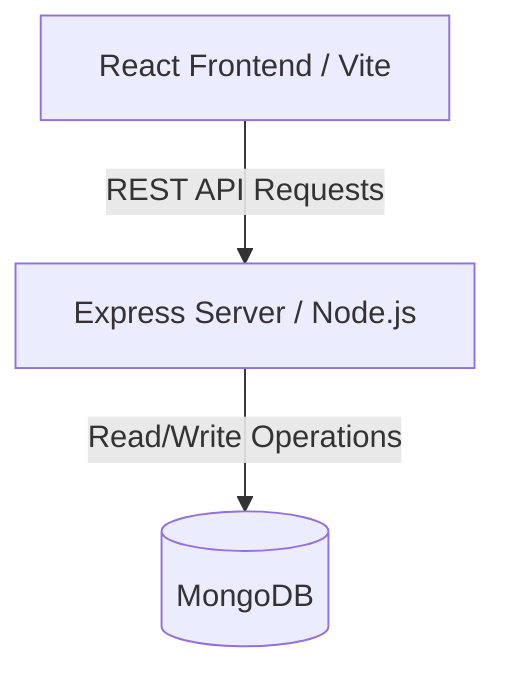

# 🍳 Sizzle & Savory - Digital Recipe Book (MERN Stack)

Welcome to **Sizzle & Savory**, a Digital Recipe Book application built on the MERN stack (MongoDB, Express, React, Node.js). This project is structured to make it easy for you to dockerize and deploy the application.

---

## 🏛️ Architecture Explanation

The application follows a decoupled client-server architecture:



### 1. Frontend (`frontend/`)
- **Framework**: React powered by Vite.
- **Styling**: Tailored, responsive Vanilla CSS with HSL-derived colors, glassmorphism, responsive grids, and clean keyframe animations.
- **State & Routing**: Standard React `useState`, `useEffect`, and component-level forms.
- **Connection Wrapper**: Exposes a configured fetch client (`src/utils/api.js`) that uses `import.meta.env.VITE_API_URL`. It falls back to `http://localhost:5000/api` for seamless local developer testing.

### 2. Backend (`backend/`)
- **Server**: Express.js running on Node.js.
- **Database Wrapper**: Mongoose connected to MongoDB.
- **Endpoints**:
  - `GET /api/recipes` - Returns list of recipes (includes text filtering and tags matching).
  - `GET /api/recipes/:id` - Returns detailed model.
  - `POST /api/recipes` - Saves a new recipe.
  - `PUT /api/recipes/:id` - Modifies a saved recipe.
  - `DELETE /api/recipes/:id` - Removes a recipe.
- **Settings**: Reads parameters (`PORT` and `MONGO_URI`) via `.env` file or direct container environment injections.

---

## 🚀 Steps to Run Locally

### Prerequisites
1. **Node.js** (v18+ recommended)
2. **MongoDB** (Local daemon running or a MongoDB Atlas URI string)

### 1. Start the Backend
1. Open a terminal and navigate to the backend directory:
   ```bash
   cd backend
   ```
2. Install the node packages:
   ```bash
   npm install
   ```
3. Create a `.env` file by copying the template:
   ```bash
   copy .env.example .env
   ```
4. Update the `MONGO_URI` value in `.env` if necessary (defaults to `mongodb://localhost:27017/recipebook`).
5. Run the dev server (with automatic reload via nodemon):
   ```bash
   npm run dev
   ```
   *The API will start running on port `5000` (`http://localhost:5000/api`).*

### 2. Start the Frontend
1. Open a new terminal and navigate to the frontend directory:
   ```bash
   cd frontend
   ```
2. Install the node packages:
   ```bash
   npm install
   ```
3. Start the Vite server:
   ```bash
   npm run dev
   ```
4. Open your browser to the URL shown (defaults to `http://localhost:3000`).

*Note: In the empty state, click the **"Import Seed Recipes"** button to instantly load 3 gourmet starter recipes (Margherita Pizza, Chicken Tikka Masala, and Greek Parfait) into MongoDB!*

---

## 🐳 Docker Guide (For Your Implementation)

To containerize the application as required in your assignment, you can use the following blueprints:

### 1. Dockerizing the Backend (`backend/Dockerfile`)
Create a `Dockerfile` inside the `backend/` directory:
```dockerfile
# Choose a lightweight Node image
FROM node:18-alpine

# Set working directory
WORKDIR /app

# Copy package descriptors and install production modules
COPY package*.json ./
RUN npm ci --only=production

# Copy application source
COPY . .

# Expose the port (5000)
EXPOSE 5000

# Start server
CMD ["npm", "start"]
```

### 2. Dockerizing the Frontend (`frontend/Dockerfile`)
Create a `Dockerfile` inside the `frontend/` directory. Since this is a React Vite app, it is best practice to compile it to static assets and serve it using Nginx:
```dockerfile
# Step 1: Build the React Application
FROM node:18-alpine AS build
WORKDIR /app
COPY package*.json ./
RUN npm ci
COPY . .
# Set the backend URL during build time
ARG VITE_API_URL
ENV VITE_API_URL=$VITE_API_URL
RUN npm run build

# Step 2: Serve the Static Assets using Nginx
FROM nginx:alpine
COPY --from=build /app/dist /usr/share/nginx/html
# Custom nginx configuration (optional, if you need routing)
# COPY nginx.conf /etc/nginx/conf.d/default.conf
EXPOSE 80
CMD ["nginx", "-g", "daemon off;"]
```

### 3. Orchestration using Docker Compose (`docker-compose.yml`)
Create a `docker-compose.yml` file in the root project directory to coordinate all services (database, backend, frontend):
```yaml
version: '3.8'

services:
  # MongoDB Database Service
  mongodb:
    image: mongo:latest
    container_name: recipe-mongodb
    ports:
      - "27017:27017"
    volumes:
      - mongo-data:/data/db

  # Backend REST API Service
  backend:
    build: ./backend
    container_name: recipe-backend
    ports:
      - "5000:5000"
    environment:
      - PORT=5000
      - MONGO_URI=mongodb://mongodb:27017/recipebook
    depends_on:
      - mongodb

  # Frontend Web Service
  frontend:
    build:
      context: ./frontend
      args:
        - VITE_API_URL=http://localhost:5000/api
    container_name: recipe-frontend
    ports:
      - "3000:80"
    depends_on:
      - backend

volumes:
  mongo-data:
```

### Useful Docker Commands:
- **Build and start services**: `docker compose up --build`
- **Stop services**: `docker compose down`
- **View container logs**: `docker compose logs -f`

---

## ☁️ Deployment Instructions

### Deploying Backend to Render
1. Create a free account at [Render](https://render.com).
2. Create a new **Web Service** and link it to your GitHub repository (or point to the subfolder `backend`).
3. Set the following parameters:
   - **Environment**: `Node`
   - **Build Command**: `npm install` (or `npm ci`)
   - **Start Command**: `npm start`
4. Add the following **Environment Variables**:
   - `PORT`: `5000` (or leave empty, Render assigns this dynamically)
   - `MONGO_URI`: Your MongoDB Atlas connection URI string (e.g. `mongodb+srv://...`).
5. Copy the generated Render public URL (e.g. `https://recipe-backend.onrender.com`). Use this URL when building your frontend container (passed to `VITE_API_URL` build arg).
